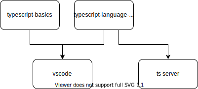
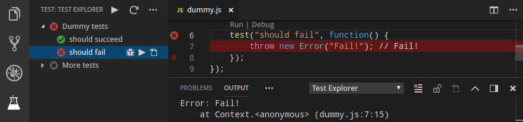
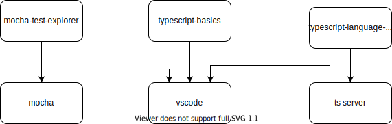

在 vscode 中，我们有如下的模块划分结构

其中 vscode 提供了字符输入，换行，响应鼠标等基础的编辑器。typescript-basics 模块依赖了 vscode，提供了代码区块的折叠能力（识别typescript的class/function语法），提供了基于词法分析的着色。而 typescript-language-features 则提供了代码补全等需要 typescript 类型检查信息的 IDE 编辑功能。

假设有一个需求是需要在文件上添加一个右键菜单，展示所有调用了这个文件的列表。我们应该修改哪个模块? 显然应该是修改 typescript-language-features，因为只有它依赖了 ts server，其他模块拿不到函数调用关系的信息。

假设需要提供一个快捷键，把整个段落的代码选中。那么我们是应该修改 typescript-basics 还是 typescript-language-features? 这个情况下，修改 typescript-basics 就可以实现。因为这个功能仅仅需要对代码做词法分析，就可以识别出“段落”来。

但是上面两个修改都不需要修改 vscode 本身。如果把对 typescript 的功能修改，实现在 vscode 这个模块里则会显得非常奇怪。就像我们在前面计费模块的案例里看到的，像 vscode 这样的位于依赖关系底层的模块，应该尽量少的改动。如果改动了之后，会导致引入很多其他上层客户不需要的功能，则违背了 common reuse principle。

如果我们要给 *.spec.ts 的文件，添加如下的业务功能

test 上面的 “Run | Debug” 就是需要新增的功能。那么我们是应该修改 typescript-basics 还是 typescript-language-features 呢? 都不应该。因为这个功能需要依赖 mocha 的 test runner，要在点击按钮之后调用 mocha 执行测试。所以实现的方式是

通过新增一个模块的方式，把新功能给实现了。这样 vscode / typescript-basics / typescript-language-features 都不需要修改。虽然最终呈现的效果是在用户打开了 *.spec.ts 文件之后，给这个编辑器增加了一个新的功能。vscode 是如何做到这一点的呢? 是因为 vscode 把编辑器上的功能做了“标准化的定义”。vscode 把自己的职责从实现需求，变成了制定标准。这些 editor 区域的标准化扩展接口就包括了

* CodeLens
* CodeAction
* Formatting
* SignatureHelp
* ...

这些扩展接口可以是 typescript-language-features 提供一部分，然后 mocha-test-explorer 实现另外一部分，由 vscode 最终集成起来。但是这个集成和前面的“业务编排API”的例子不同。不同之处体现在了依赖关系上，vscode 是被 typescript-language-features 依赖，而不是 vscode 同时依赖了 typescript-language-features 和 mocha-test-explorer 去把这两个模块整合起来。

从这个例子里我们可以看到如下的规律

* 一个新功能要修改哪个模块取决于模块的依赖关系。typescript-language-features 在依赖关系里有 ts server，所以一些功能就得改它那里。
* 新增模块来实现新功能可以避免把给现有模块添加新的依赖，比如 mocha 这个依赖就只需要加到 mocha-test-explorer 上。是否新增一个模块，还是修改已有的模块，是否引入依赖是一个关键决策因素。

稍微有点经验程序员都能体会到 vscode 做为 Eric Gamma 大神在 eclipse 之后的又一力作，架构上是很优秀的。但可能只是感觉优秀，又说不出来优秀在哪里。通过这个例子，我们就可以看到，判断一个模块拆分结构是否优秀的唯一标准，就是看它如何处理需求的变更和新增。当所有的需求都要往一个模块里改的时候，这个拆分就是糟糕的。当新的需求往往可以通过新增模块来实现的时候，这个拆分结构就是优秀的。
