# 依赖管理的判断标准

* 越底层的模块要减少修改，把需求实现在上层的模块里：案例1
* 不应该把改动都堆在同一个模块里做：案例1，案例2
* 不要一次改动经常需要改多个模块：案例4
* 不要轻易给已有模块加新的依赖：案例3
* 能新增模块来实现新需求是最不过了：案例3

经常修改的应该是上面这个依赖关系的中间这一层。

留下的疑问：不能每做一个需求，都改最顶上一层的编排，那么多个顶层模块之间是什么关系?怎么集成呢? 

# 接口耦合性的判断标准

* 基于RPC调用的模块接口耦合性太强：案例5
* 松耦合接口选项1 - UI组合：案例6
* 松耦合接口选项2 - 事件：案例7
* 松耦合接口选项3 - Pull 代替 Push：案例8
* 松耦合接口选项4 - 伪装成存储：案例8

# WHY

看完了8个案例，有两个问题

* 有大量的实际业务中的项目，违反了所有的最佳实践。但是商业上仍然大获成功
* 从1971年的《On the criteria to be used in decomposing systems into modules》开始，就不断鼓吹要做好模块分解。为什么这么多年过去了，不但没有看见进步，甚至感觉还在退步?

前两天在朋友圈刷到一句睿智的话

* 当你听到别人的一个想法的时候，先想想为什么行得通
* 当你要提出一个想法的时候，先想想为什么行不通

行得通的理由

* 虽然不用最佳的模块切分，会导致更多的联合修改联合调试，但是仍然可以完成需求
* 目标是及时响应市场需求，这并不完全依赖好的模块切分。通过996，通过找更多的人，仍然可以达成目标。
* 设计简单，新人更容易上手
* 弊端需要成年累月才会显现出来，对创业期没有影响

行不通的理由

* 前端技术最近几年变动特别剧烈，一直稳定不下来
* UI非常专业，需要独立的团队。没法实现端到端的业务切分
* 运行时报错信息是在一起的，这么分着写很难和运行时的现象对应起来
* 需求可能是跨模块的，创新性的需求往往会对模块化的假设产生剧烈的影响
* 产品经理的分工调整，产品需求的粒度是经常变化的，导致一个产品经理需要改多个模块
* 编辑的时候往往需要在更多的模块/目录/文件之间跳转

# 变量是什么

从1971到2020，已经接近50年了。如果没有什么变量，代码的模块化不会有什么实质性的变化。有哪些变量，使得之前的“行得通”变成了“行不通”，又有哪些变量，使得之前得“行不通”变成了“行得通”。
第三章，“模块组合的实现技术演进” 就来讨论这个问题。