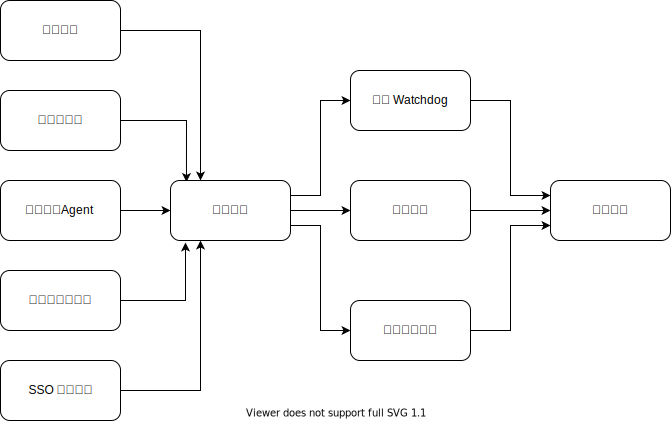
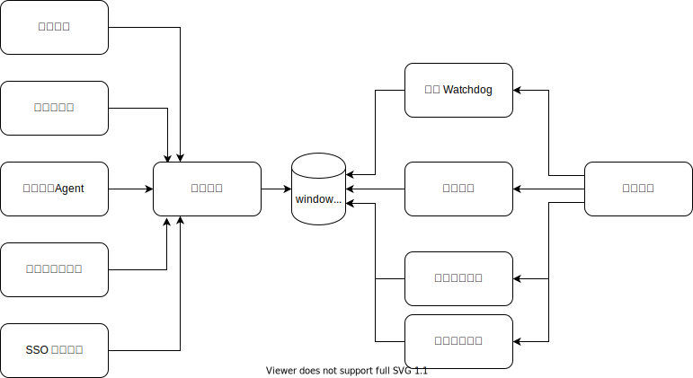

假设有这么一个虚构的故障检测与分析的业务， 其模块构成如下



从网络探针，主机Agent等多个渠道，都会有探测器不断上报到消息队列里。掉底watchdog订阅消息队列，监控是否有数据中断的情况。盗刷风控则是反作弊团队维护的规则引擎，有复杂事件的检测能力。数据汇总给故障分析模块，进行统一的根因分析。为了协助故障分析，前置了一个通用异常检测模块，去筛选出正常事件流里的异常特征，例如同环比的突变等。

假设有一个需求是要支持指标的一定程度的延迟和乱序。比如SSO平台事件可能会稍微晚30s才上报过来。为了支持事件流到达顺序的不一致，掉底watchdog需要添加一个缓冲区，晚一点才做掉底的识别。盗刷风控也需要加一个缓冲区，通用异常检测也需要加缓冲区。所有消费事件的处理模块都需要做一遍修改。各个处理的时间也可能不同，所以最终到达故障分析模块的时间也可能不同，所以故障分析模块也需要加一个缓冲区来汇总。

假设又有一个需求，网络探针模块进行了升级，从 protobuf 的序列化格式，修改成了 thrift 格式的。虽然掉底 watchdog 和盗刷风控都是订阅的消息队列，但是对消息的格式的变化仍然需要修改这些下游模块。即便这个消息格式的变化引入的新数据对掉底 watchdog 来说毫无价值，仍然需要修改掉底 watchdog。其实从掉底与否的角度来说，你报了就是报了，没报就是没报，对报文内容是完全不关心的。



如果我们把依赖关系翻转过来，从 push 改成 pull 则会方便很多。所有的事件上报都在上报之前就统一成同样的格式。引入一个 window 模块把最近一段时间内的事件存入多维分析的数据库里。

对于掉底watchdog来说，基本上永远不用修改了。就是定时查询一下 window 模块，看看是不是有数据中断就可以了。

对于盗刷风控来说，可以把自己的内部 buffer 给去掉了。由 window 模块统一屏蔽了事件上报的乱序和延迟问题。查询的维度和指标都是按照业务需求来确定的，不相关的上报格式的修改，只要不牵涉到关心的维度，就可以不修改盗刷风控模块。

对于故障分析来说，之前是被动接收事件

```typescript
onNetworkAnomaly(site, floor, segment) {
}
onClusterDown(cluster) {
}
```

所有的事件都是已经分析出来的结论，计算已经做完了。提供过来的信息就是所有能提供的信息。
而把依赖关系反转过来之后，就是故障分析根据自己所需要的信息去查询：

```typescript
queryAnomaly(target, anomalyType)
```

这样做的好处是可以最小化依赖。如果故障分析不需要的信息，就可以不会被使用到。
假设说说上游提供了一个目录的数据供查询。下游根据实际需要决定的查询的路径，比如 `readFile('site1/cluster1/anomaly')` 。也就是基于 pull 的策略，来按需决定依赖。那么没有使用到的路径，比如 `site2/cluster3/anomaly` 改动了也不会有影响。
而且还有可能，这个计算是按需触发的，也就是你去调用 `queryAnomaly` 的时候现算的。就算是你使用的是文件系统的 api，比如 `readFile`，linux 也有 FUSE 这样的文件系统，可以把 readFile 转换成例如查询 gmail 邮件这样的网络调用。从数据提供方选择“实现方式”的角度来说，提供 query 性质的接口也给予了实现更大的灵活度。

这个例子想说明两个问题：

* pull v.s. push：在所有视图渲染，事件模式检测类的业务里。pull 都是更好的策略，它可以产生最精确的依赖关系，减少变更的影响范围。
* onNetworkAnomaly v.s. readFile：使用类似 readFile 这样的函数名去 pull 的时候，可以让模块之间的依赖更稳定。因为存储性质的 get/set API，是最稳定不易变的。虽然，微服务之间不应该修改彼此的内部数据库。但是把自己的对外可查询状态伪装成一个数据库的通用查询接口暴露出来，却可以提高接口的稳定性，减少模块之间 ad-hoc 的 API 定义。