假设有如下的论坛业务，其现有模块划分如下图所示

用户每次发帖，都要给用户添加一些积分。

假设需要添加一个需求，用户一天发了三个帖子之后，完成了“每日活跃”任务，额外奖励更多的积分。如果是修改“帖子模块”就是

在发放积分之前，先查询一下任务模块，再决定发多少。

假设又有一个需求，如果是新用户发的首个帖子，需要给邀请人发放积分。如果仍然是修改“帖子模块”，就需要变成这样

从做需求的角度来说，帖子模块已经在发放积分了，我这个需求不过是给如何发积分添加了一些花样而已，改动很小的。但是每次改动，仍然是需要帖子模块和其他模块进行联调。
要减少模块之间的耦合就是要减少模块之间这样的 `f(args)` 的直接调用关系。

帖子模块把新建帖子的事件发到消息队列之后就可以不管了。任务模块，拉新模块要做什么自己的逻辑，都可以自己去订阅这个消息队列。
帖子模块用对“消息队列”的依赖，替换了对积分模块，任务模块，拉新模块的依赖。