假设我们有如下的一个模块划分结构



计费系统提供了统计一个订单的里程，综合计算出费用的功能。专车，快车，企业等业务线都会复用这个计费系统来出自己的账单，收取费用。
我们不讨论是否是小前台大中台。这个问题和大小没关系，也和这些模块现存的代码量没有关系。
我们来考虑一个问题，就是当需求来了的时候，应该改哪个模块的问题。

假设快车需要做一个拼车的功能，需要给司机出一个账单，给乘客出另外一个账单。司机需要按实际行驶时长和里程计费，乘客只需要一个一口价就可以。那么我们改哪个模块呢?
如果改计费模块，那么大概是这样的

```
beginOrder(orderDetails, isPinChe) {
}
```

根据这个 isPinChe 的标志位，计费系统会计算出两个账单出来。但是似乎里程计算并不受到影响，因为实际上只有司机需要计算里程。

然后我们又添加了一个需求，如果司机的账单和乘客的一口价之间差价过大，则可能是司机故意绕路，骗取平台的补贴。那么这个时候，需求就是要把乘客的账单从一口价，改成乘客所乘坐区段的实际账单。
注意这个实际乘坐区段并不等于司机的行程里程。因为如果有两个乘客前后上车，两个乘客的区段重叠之后合计里程，才是司机的行驶里程。
那这个时候计费系统就需要维护订单和行程，两个级别的账单。

```
beginTrip() {
}
beginOrder(orderDetails, isPinChe) {
}
```

这个会造成一个问题，就是这个功能其实是快车产品线独有的。企业出行的产品是不需要这部分代码的，但是他们有自己的独特需求。
企业出行的需求是他需要能够以快车的费用给企业报销，但是实际乘客是打的专车，然后用专车计费模式计算出来的账单是乘客+乘客所在企业实际需要支付给平台的。
快车费用和专车费用之间的差价，需要由乘客本人自己补齐。这个时候就变成了企业出行要的不是拼车行程一个司机账单，拼车订单给每个乘客一个账单。而是说给企业一个账单，给乘客一个账单。
然后，我们又接着修改计费系统

```
beginOrder(orderDetails, isPinChe, isQiYe) {
}
```

我们可以看到，这个模式的显著缺点：

1. 计费系统和其用户之间的接口会越来越复杂，isXXX 的参数越加越多。这些复杂性是大部分用户用不到的，但是被迫接受。
1. 计费系统被多个业务线复用，其稳定性会影响很大。对计费系统的频繁修改，导致所有业务线的稳定性都受到影响。

在 [Agile Software Development](https://www.amazon.com/Software-Development-Principles-Patterns-Practices/dp/1292025948) 书中，Robert Martin 讲过了很重要的两个原则

* 越是被很多模块依赖的模块，越应该减少改动。道理很简单，底层模块一改，上层的模块必然受到影响。依赖关系的方向，就是“不稳定”依赖“稳定”的方向。
* Common Reuse Principle。要复用的模块不要把过多的东西捆绑，要复用就整体复用。

如果仅仅根据上面这两个需求，把计费系统拆成多个是更合理的

* 司机的行程计费
* 乘客的专车计费
* 乘客的快车计费

然后又上层的模块，由这些依赖关系上处于更不稳定位置的模块，去写不稳定的业务逻辑。